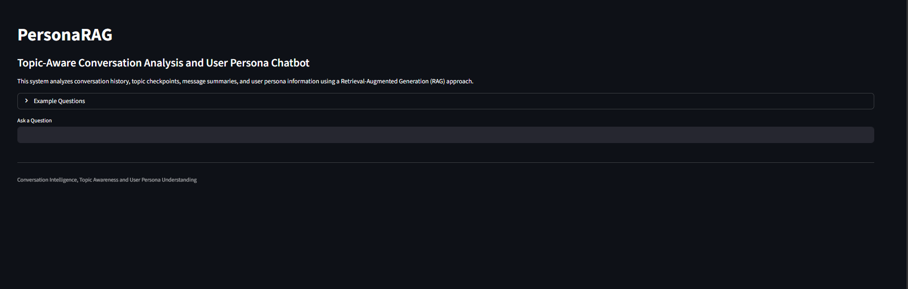
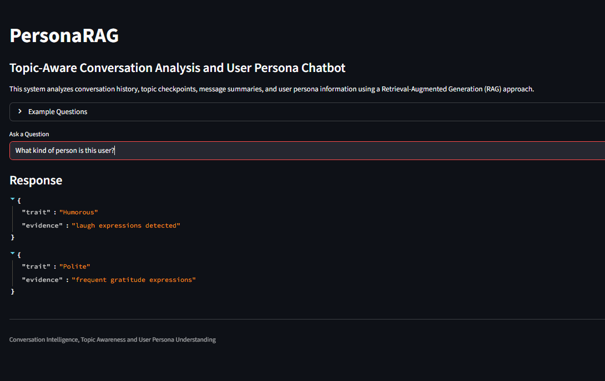
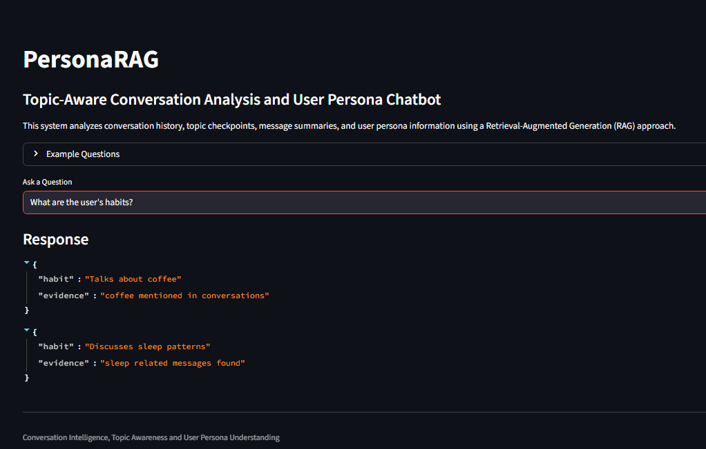
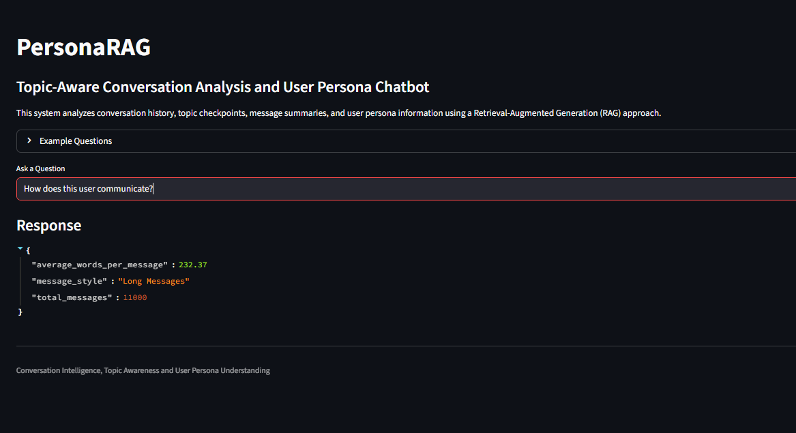

# PersonaRAG: Topic-Aware Conversation Analysis & User Persona Chatbot

## Project Overview

This project processes conversation data chronologically and builds a Retrieval-Augmented Generation (RAG) based chatbot. The system detects topic changes, generates topic checkpoints, creates 100-message checkpoints, extracts user persona information, and answers user queries through a Streamlit-based interface.

The objective is to analyze long conversation histories and provide meaningful retrieval using topic summaries, message checkpoints, and persona information.

---

## Features

* Chronological message-by-message processing
* Topic checkpoint generation
* 100-message checkpoint summaries
* User persona extraction
* RAG-based retrieval
* Streamlit chatbot interface
* Structured JSON outputs

---

## Topic Detection

Messages are processed sequentially in chronological order.

SentenceTransformer (`all-MiniLM-L6-v2`) embeddings are generated for messages.

Cosine similarity is used to detect topic changes.

Whenever similarity falls below a predefined threshold:

* A new topic checkpoint is created
* Message range is stored
* Topic summary is generated

Each topic checkpoint stores:

* Topic ID
* Message Range
* Topic Summary

---

## 100 Message Checkpoints

Independent summaries are generated for every 100 messages.

These checkpoints provide broader context and help retrieval across long conversation histories.

Example:

* Checkpoint 1 → Messages 1–100
* Checkpoint 2 → Messages 101–200
* Checkpoint 3 → Messages 201–300

---

## Persona Extraction

The system extracts:

### Habits

* Coffee-related discussions
* Sleep-related patterns

### Personal Facts

* Education references
* Career and job-related discussions

### Personality Traits

* Humorous
* Polite

### Communication Style

* Average words per message
* Message length pattern
* Total messages processed

The extracted persona is stored in JSON format.

---

## Retrieval (RAG)

For each user query:

1. Relevant topic summaries are retrieved.
2. Relevant message checkpoints are searched.
3. Persona information is retrieved when applicable.
4. Retrieved context is used to answer user questions.

This combines topic checkpoints, message checkpoints, and persona information to provide contextual responses.

---

## Output Files

The system generates:

* messages.json
* topic_summaries.json
* checkpoints.json
* persona.json

---

## Example Questions

* What kind of person is this user?
* What are the user's habits?
* How does this user communicate?
* What topics were discussed?
* Tell me about the user's personality traits.

---

## Screenshots

### Home Interface



Main PersonaRAG chatbot interface.

### Personality Trait Extraction



Extracted personality traits with supporting evidence.

### Habit Detection



Detected user habits from conversation history.

### Communication Style Analysis



Communication pattern and message statistics.

### Topic Checkpoint Retrieval


Retrieved topic checkpoints and summaries.

---

## Project Structure

```text
KaStack_Assignment/
│
├── app.py
├── rag.py
├── topic_detection.py
├── topic_checkpoints.py
├── checkpoints.py
├── persona_builder.py
├── requirements.txt
├── README.md
│
├── data/
│   └── conversations.csv
│
├── output/
│   ├── messages.json
│   ├── topic_summaries.json
│   ├── checkpoints.json
│   └── persona.json
│
└── screenshots/
    ├── home.png
    ├── persona.png
    ├── habits.png
    ├── communication.png
    └── topics.png
```

---

## Installation

```bash
pip install -r requirements.txt
```

---

## Run Instructions

```bash
python topic_detection.py

python topic_checkpoints.py

python checkpoints.py

python persona_builder.py

streamlit run app.py
```

---

## Technologies Used

* Python
* Pandas
* SentenceTransformers
* Scikit-learn
* Streamlit
* JSON

---

## Key Highlights

* Processed 11,000+ messages chronologically
* Generated 174 topic checkpoints
* Generated 110 message checkpoints
* Generated topic summaries using topic checkpoints
* Extracted structured user persona
* Built a Streamlit-based RAG chatbot
* Implemented semantic topic detection using embeddings

---


